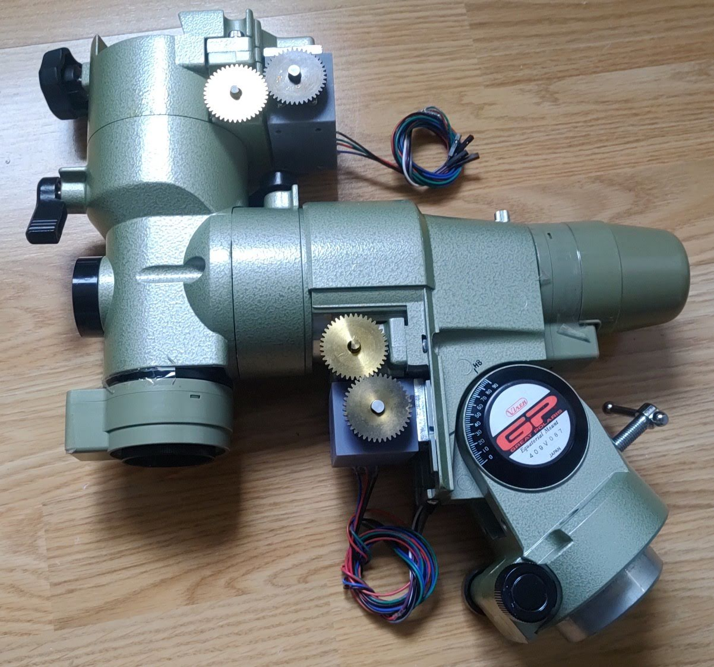
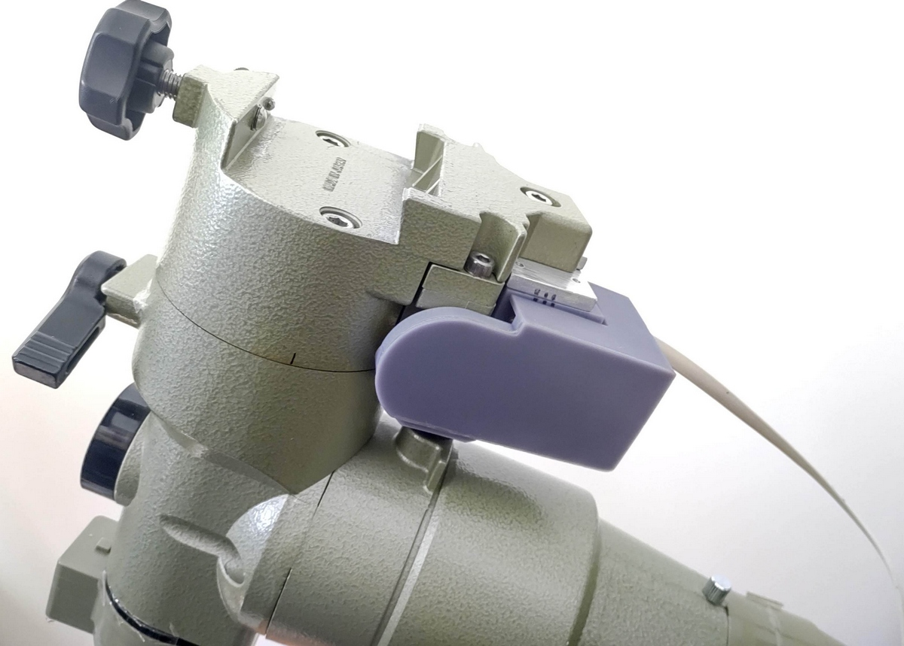
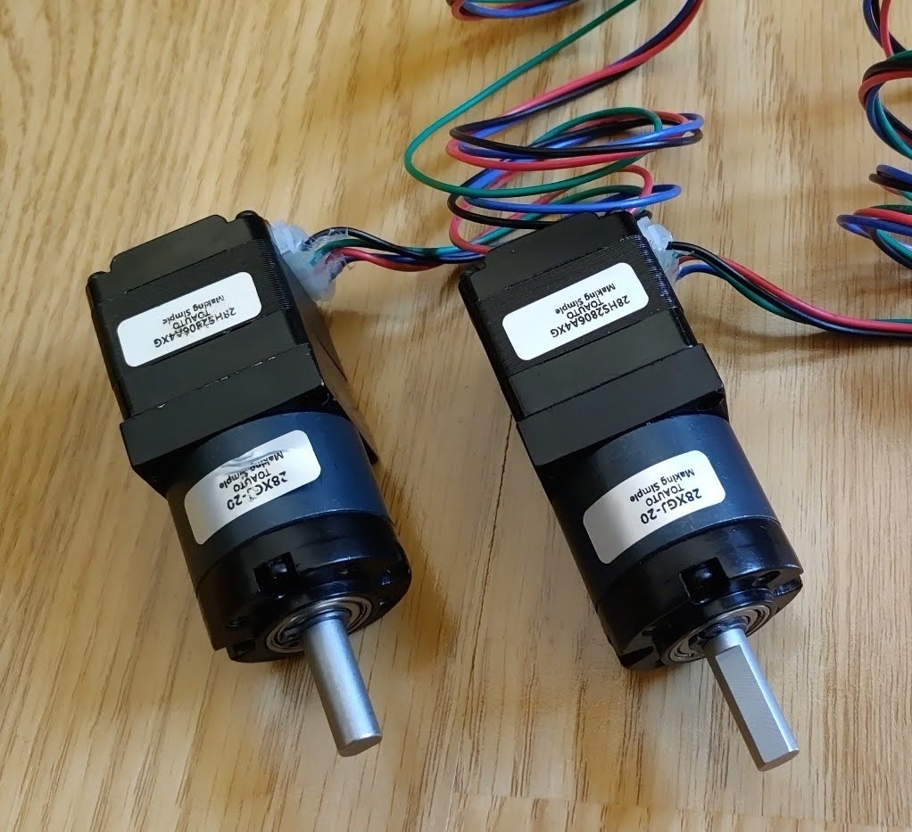
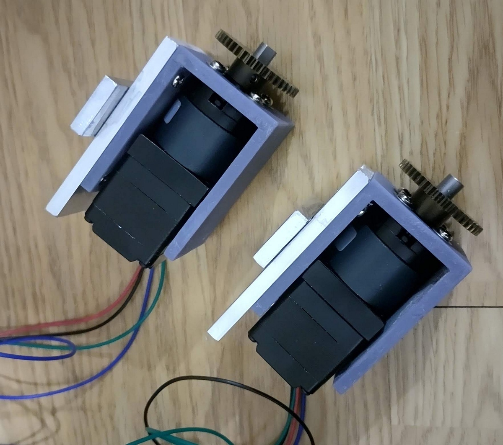
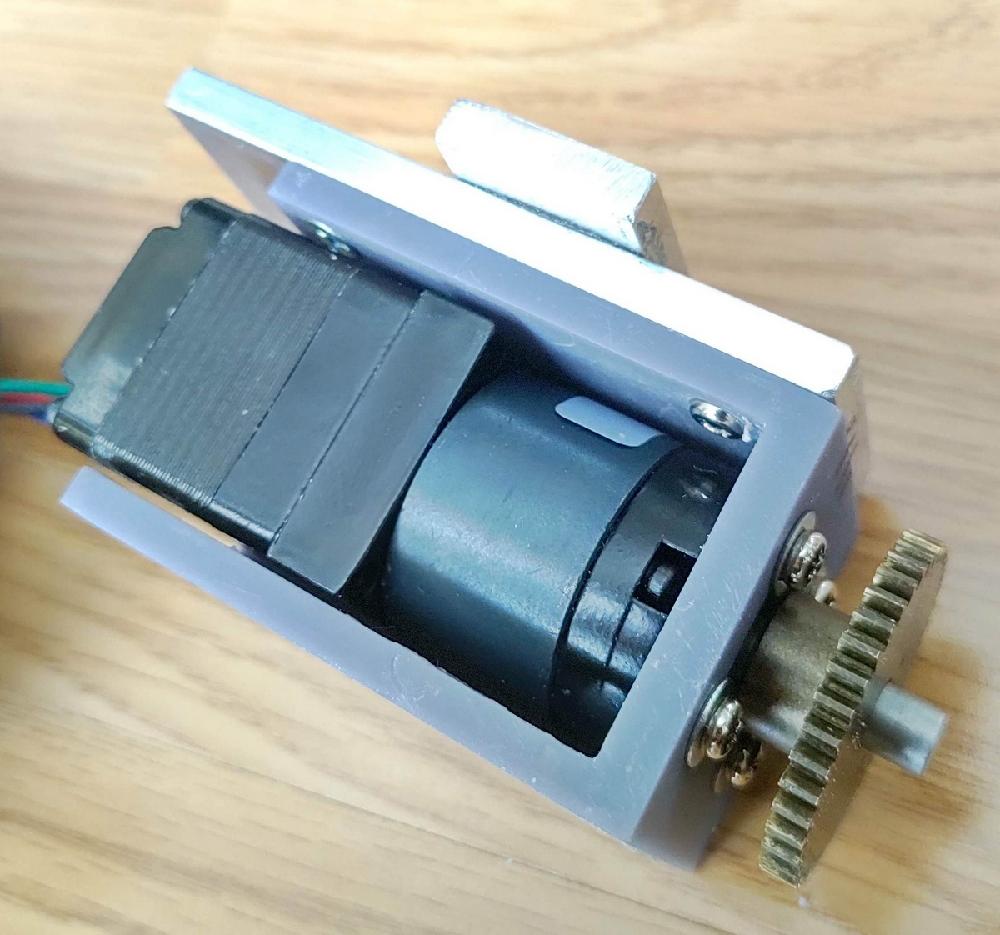
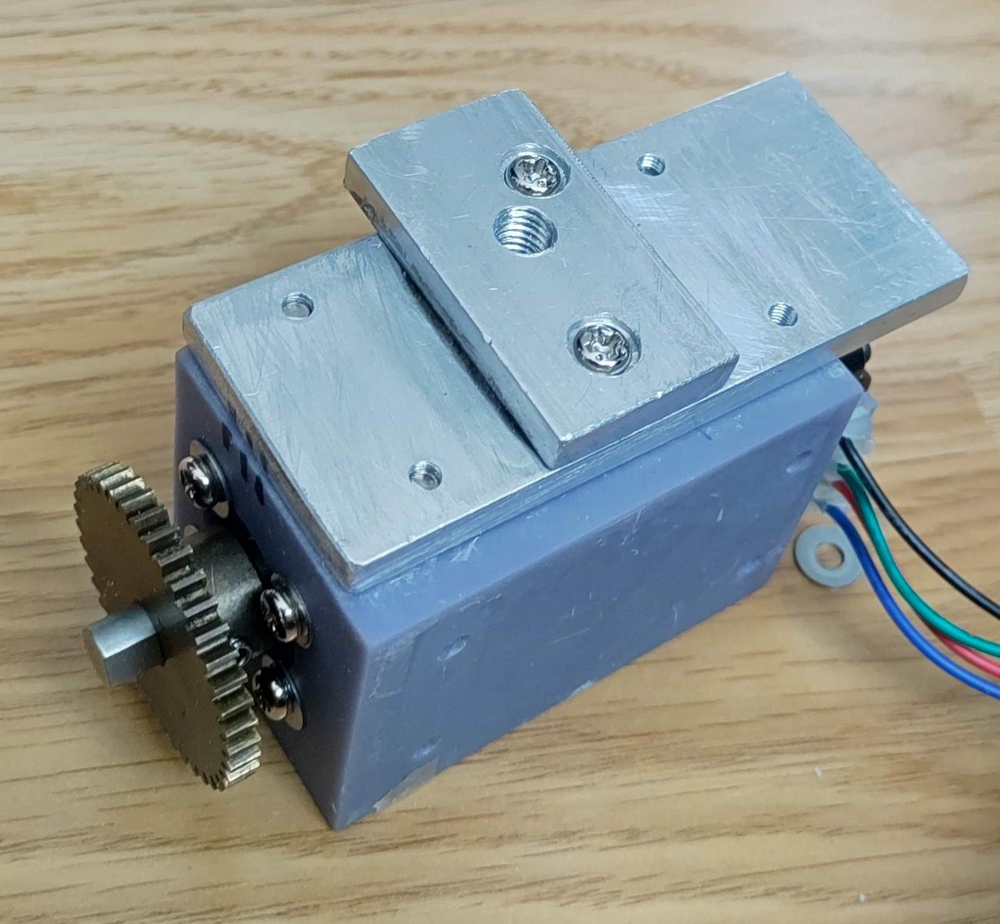
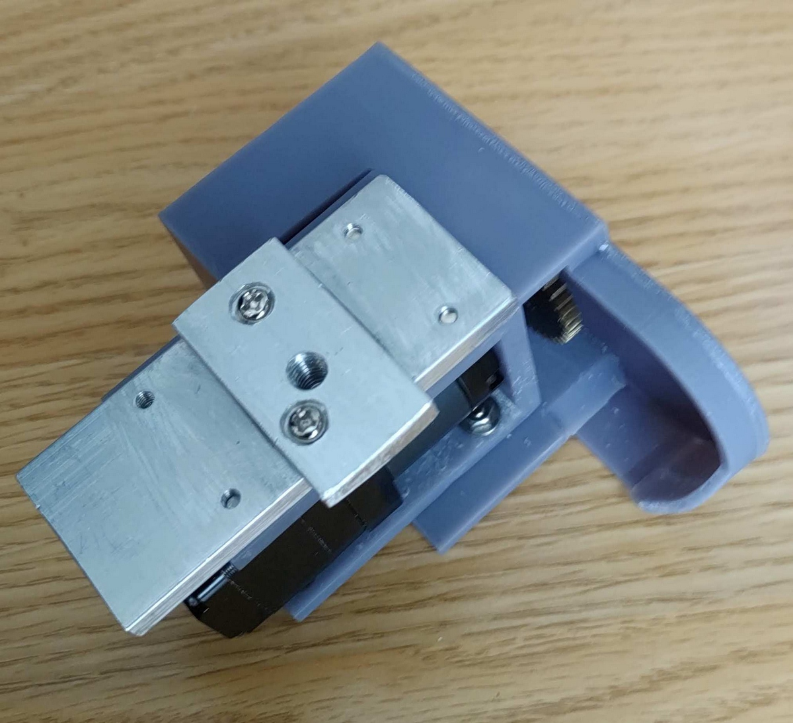

# GP_Mount_Motor_Drive_Bracket
This is the design drawing of the bracket for mounting a NEMA 11 geared stepper motor on a GP equatorial mount.
It can be used as a motor unit to implement [OnStep](https://onstep.groups.io/g/main) on a GP equatorial mount.

https://user-images.githubusercontent.com/6793745/152669676-45784982-78b3-44c9-a509-48ccae44db28.mp4

## Parts List
* [Nema11 Stepper Motor with 20:1 Planetary Gearbox](https://www.ebay.com/sch/i.html?_nkw=planetary+gearbox+nema11+stepper) (28HS2806A4XG 28XGJ-20)
* [KYOIKU GEARS S75B40B+0306](https://sg.misumi-ec.com/vona2/detail/221000073027/?HissuCode=S75B40B%2B0306) (Module0.75 40teeth 30mm shaft6mm)
* GP Motor Base : These can be cut out from 5mm thick aluminum plate. ([STL](GP%20Motor%20Base.stl))
  * GP Motor Base Parts1 : ([DRAWINGS](GP%20Motor%20Base1.png))
  * GP Motor Base Parts2 : ([DRAWINGS](GP%20Motor%20Base2.png))
* NEMA11 Geared Bracket : 3D Printed Parts ([STL](NEMA11%20Geared%20Bracket.stl))
* GP Motor Cover : 3D Printed Parts ([STL](GP%20Motor%20Cover%20v15.stl))

## Note
When a NEMA 11 stepper motor with a gear ratio of 1:20 was driven by 12V, it was possible to introduce 480x speed. However, this may depend on the condition of the equatorial mount bearings.

## Pictures

|    |    |
| ---- | ---- |
|    |    |
|    |    |
|    |  - |

## License
* 
  * https://creativecommons.org/licenses/by-sa/4.0/
* [TAPR Open Hardware License (OHL)](https://tapr.org/the-tapr-open-hardware-license/)
  * https://files.tapr.org/OHL/TAPR_Open_Hardware_License_v1.0.txt
